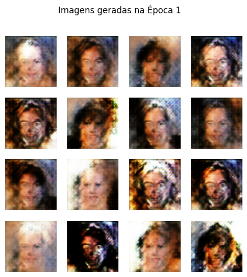
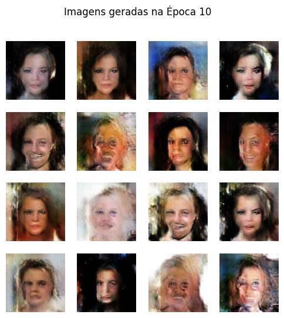

# Gerador de Rostos com DCGAN

Este repositório contém um notebook do Google Colab que implementa uma **Rede Adversarial Geradora Convolucional Profunda (DCGAN)** do zero para gerar imagens de rostos humanos.

O projeto foi desenvolvido como um estudo prático sobre os fundamentos das GANs, utilizando Python, TensorFlow/Keras e o popular dataset **CelebA (CelebFaces Attributes)**.

---

## 📈 Resultados: A Evolução do Treinamento

O modelo foi treinado por um período limitado de **10 épocas** (aproximadamente 1 hora e 40 minutos), o que não é suficiente para gerar rostos fotorrealistas. No entanto, a comparação entre o início e o fim do treinamento demonstra uma clara evolução e a capacidade da rede de aprender a estrutura fundamental de um rosto a partir do puro ruído.

| Após a 1ª Época | Após a 10ª Época |
| :---: | :---: |
| *A rede começa a aprender contornos e cores básicas.* | *Estruturas mais nítidas começam a surgir.* |
|  |  |

---

## 🛠️ Arquitetura

O projeto utiliza uma arquitetura DCGAN padrão:

* **Gerador:** Usa camadas `Conv2DTranspose` para fazer o "upsampling" de um vetor de ruído latente até se transformar em uma imagem 64x64.
* **Discriminador:** É uma CNN (Rede Neural Convolucional) que classifica se uma imagem é real (do dataset) ou falsa (criada pelo gerador).
